# ELEVATE-TASK-1

# 🚢 Titanic Dataset - Data Cleaning & Preprocessing Tutorial


A comprehensive tutorial demonstrating data cleaning and preprocessing techniques using the famous Titanic dataset. This project showcases best practices in data preparation for machine learning, complete with beautiful visualizations at every step.

---

## 📋 Table of Contents

- [Overview](#overview)
- [Features](#features)
- [Installation](#installation)
- [Dataset](#dataset)
- [Data Processing Steps](#data-processing-steps)
- [Visualizations](#visualizations)
- [Results](#results)
- [Technologies Used](#technologies-used)
- [Learning Outcomes](#learning-outcomes)
- [Output Files](#output-files)
- [Usage](#usage)
- [Contributing](#contributing)
- [License](#license)
- [Contact](#contact)

---

## 🎯 Overview

This project provides a complete end-to-end tutorial on data cleaning and preprocessing using the Titanic dataset. It demonstrates essential data science techniques including:

- **Missing value detection and handling**
- **Categorical feature encoding**
- **Outlier detection and removal**
- **Feature scaling and normalization**
- **Data visualization throughout the process**

The tutorial is designed for beginners and intermediate data science practitioners who want to understand the crucial preprocessing steps before building machine learning models.

---

## ✨ Features

### 🔍 **Comprehensive Data Exploration**
- Initial dataset analysis with statistical summaries
- Distribution visualizations for all features
- Survival rate analysis across different variables

### 🛠️ **Missing Value Handling**
- Automatic detection of missing values
- Multiple imputation strategies (median, mode, feature engineering)
- Before/after visualizations

### 🎨 **Feature Engineering**
- Binary feature creation from high-cardinality columns
- Label encoding for binary categorical variables
- One-hot encoding for multi-class categorical variables

### 📊 **Outlier Detection & Treatment**
- IQR-based outlier detection
- Visual identification through boxplots and histograms
- Strategic outlier removal with impact analysis

### ⚖️ **Feature Scaling**
- StandardScaler implementation
- Comprehensive before/after comparisons
- Distribution normalization

### 📈 **Rich Visualizations**
- 15+ detailed visualization plots
- Professional styling with custom color palettes
- Interactive and informative charts

---

## 🚀 Installation

### Prerequisites

Ensure you have Python 3.8+ installed on your system.

### Step 1: Clone the Repository

```bash
git clone https://github.com/atharvam177/elevate-task-1.git
cd elevate-task-1
```

### Step 2: Install Dependencies

```bash
pip install pandas numpy matplotlib seaborn scikit-learn kagglehub
```

Or use the requirements file (create one if needed):

```bash
pip install -r requirements.txt
```

### Step 3: Run the Script

```bash
python cleaning_data.py
```

---

## 📊 Dataset

### Source
The Titanic dataset is automatically downloaded from Kaggle using the `kagglehub` library.

### Dataset Information
- **Rows**: 891 passengers
- **Columns**: 12 features
- **Target Variable**: Survived (0 = Died, 1 = Survived)

### Features

| Feature | Description | Type |
|---------|-------------|------|
| **PassengerId** | Unique identifier | Numeric |
| **Survived** | Survival status (0/1) | Binary |
| **Pclass** | Passenger class (1st, 2nd, 3rd) | Categorical |
| **Name** | Passenger name | Text |
| **Sex** | Gender | Categorical |
| **Age** | Age in years | Numeric |
| **SibSp** | # of siblings/spouses aboard | Numeric |
| **Parch** | # of parents/children aboard | Numeric |
| **Ticket** | Ticket number | Text |
| **Fare** | Passenger fare | Numeric |
| **Cabin** | Cabin number | Text |
| **Embarked** | Port of embarkation | Categorical |

---

## 🔄 Data Processing Steps

### **Step 1: Load and Explore Dataset** 📥

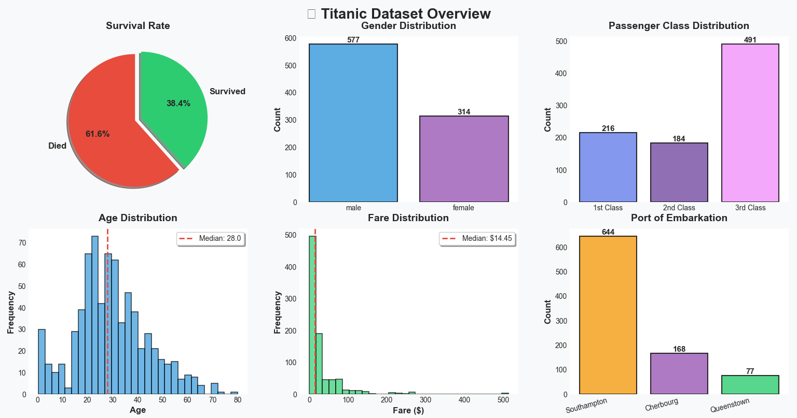
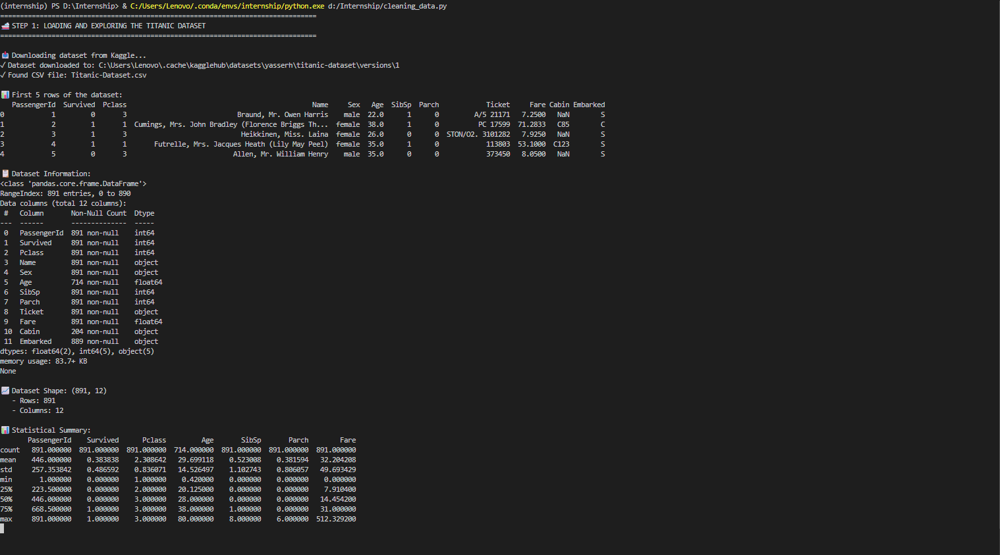

- Download dataset from Kaggle automatically
- Display first rows and dataset information
- Generate statistical summaries
- Create comprehensive overview visualizations

**Key Insights:**
- 891 total passengers
- 38.4% survival rate
- Gender distribution: 577 male, 314 female
- Age range: 0.42 to 80 years

---

### **Step 2: Handle Missing Values** 🔍

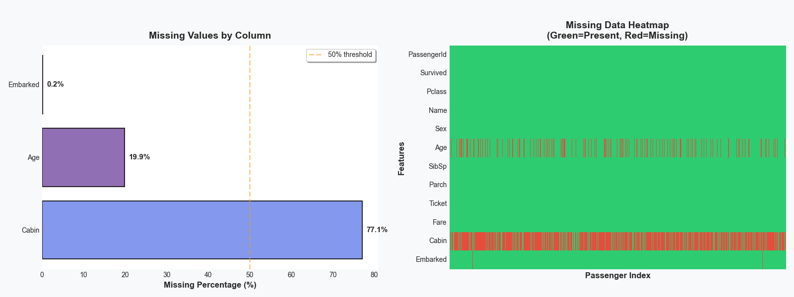


**Missing Data Found:**
- **Cabin**: 687 missing (77.1%)
- **Age**: 177 missing (19.9%)
- **Embarked**: 2 missing (0.2%)

**Treatment Strategies:**
1. **Age**: Filled with median (28.0 years)
2. **Embarked**: Filled with mode ('S' - Southampton)
3. **Cabin**: Created binary feature `Has_Cabin` and dropped original
4. **Fare**: Filled with median if any missing

**Result:** ✅ Zero missing values after treatment

---

### **Step 3: Encode Categorical Features** 🔢

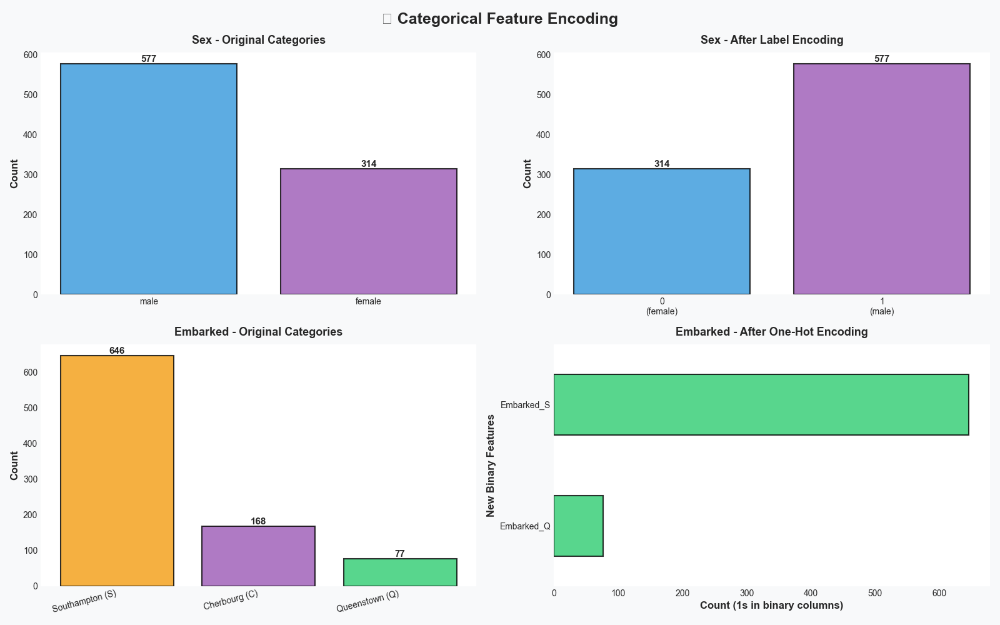
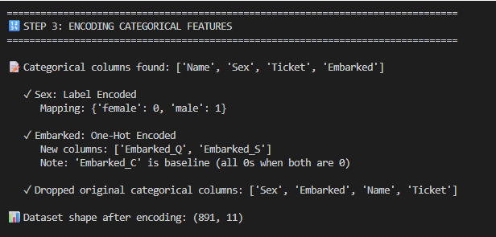

**Encoding Methods:**

1. **Label Encoding for Sex**
   - female → 0
   - male → 1

2. **One-Hot Encoding for Embarked**
   - Created: `Embarked_Q` and `Embarked_S`
   - Baseline: Embarked_C (when both are 0)

3. **Dropped Columns**
   - Name, Ticket, Sex, Embarked (originals)

**New Dataset Shape**: (775, 11) after encoding

---

### **Step 4: Detect Outliers** 🎯

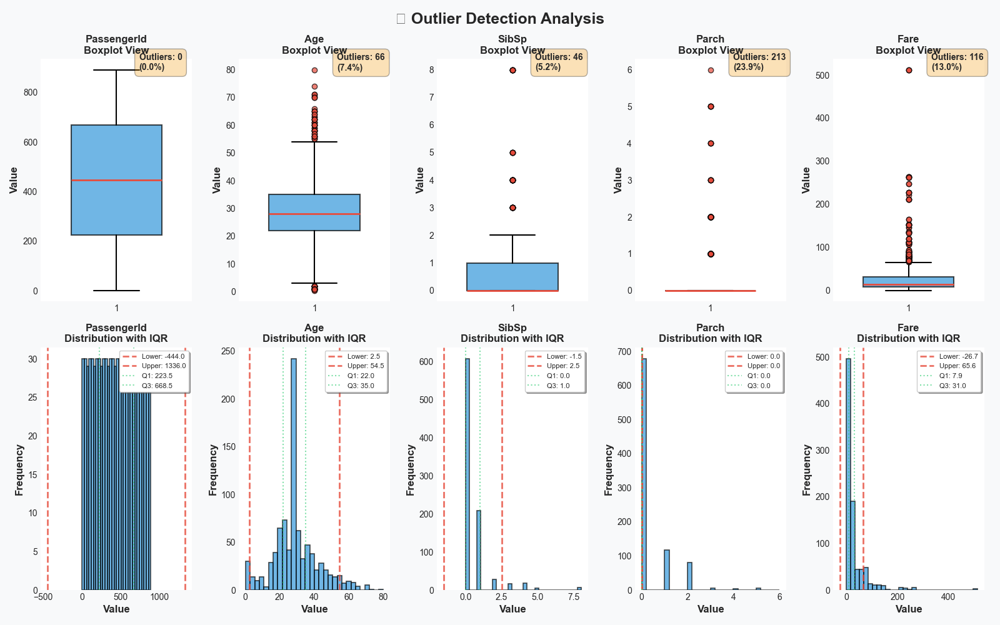
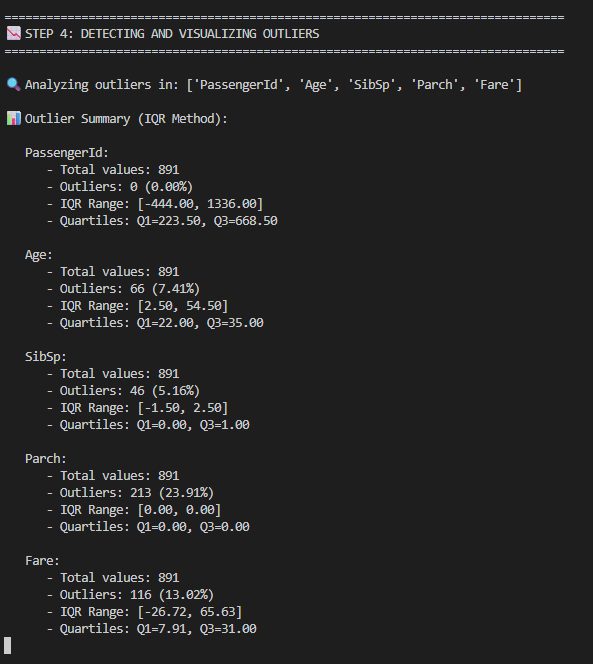

**IQR Method Used** (Interquartile Range)

**Outliers Detected:**
- **PassengerId**: 0 outliers (0.00%)
- **Age**: 66 outliers (7.41%)
- **SibSp**: 46 outliers (5.16%)
- **Parch**: 213 outliers (23.91%)
- **Fare**: 116 outliers (13.02%)

Each feature analyzed with:
- Boxplot visualization
- Distribution histogram with IQR boundaries
- Statistical summary

---

### **Step 5: Remove Outliers** 🗑️

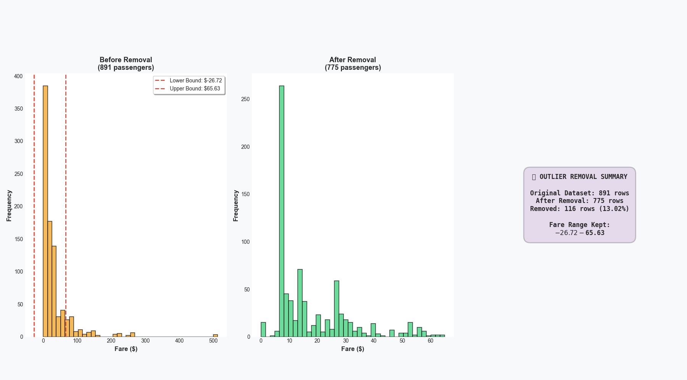
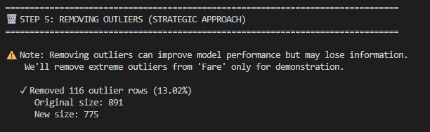

**Strategy**: Remove extreme outliers from Fare only

**Impact:**
- Original size: 891 rows
- After removal: 775 rows
- Removed: 116 rows (13.02%)
- Fare range kept: $-26.72 to $65.63

---

### **Step 6: Feature Scaling** ⚖️

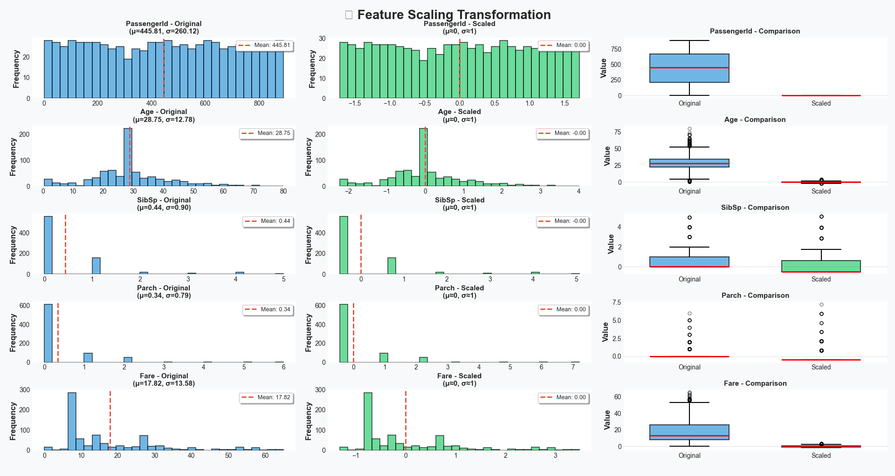
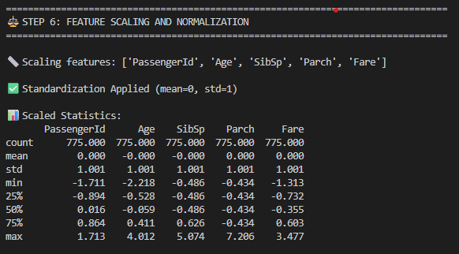

**StandardScaler Applied** (mean=0, std=1)

**Features Scaled:**
- PassengerId
- Age
- SibSp
- Parch
- Fare

**Comparison Visualizations:**
- Original vs Scaled distributions
- Before/After boxplots
- Statistical transformation summary

---

### **Step 7: Final Dataset Summary** 🎉

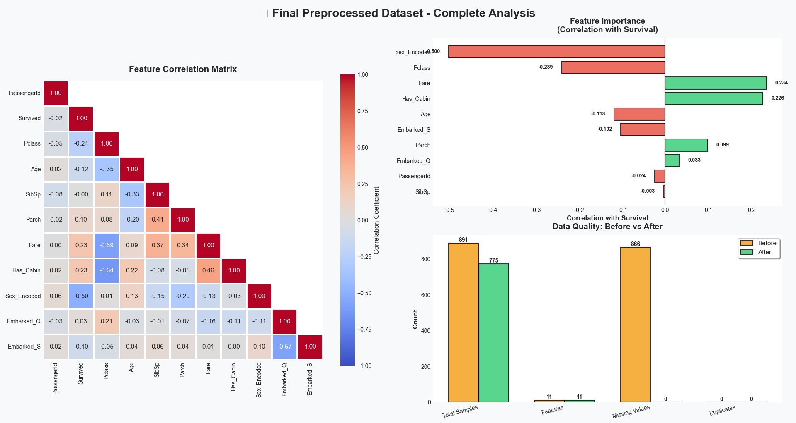
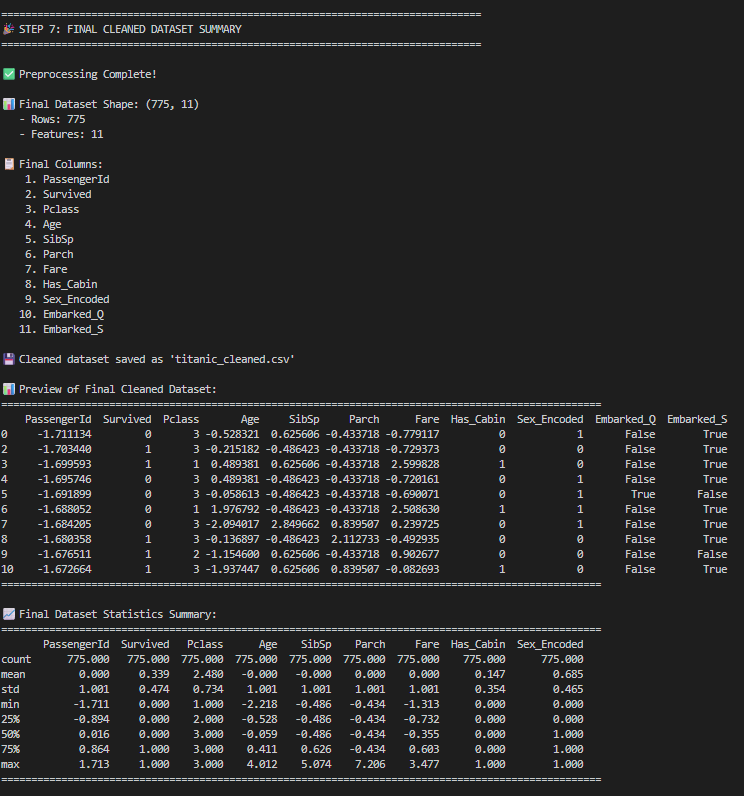

**Final Statistics:**
- **Total Samples**: 775
- **Features**: 11
- **Missing Values**: 0
- **Duplicates**: 0

**Final Columns:**
1. PassengerId (scaled)
2. Survived
3. Pclass
4. Age (scaled)
5. SibSp (scaled)
6. Parch (scaled)
7. Fare (scaled)
8. Has_Cabin
9. Sex_Encoded
10. Embarked_Q
11. Embarked_S

---


## 📊 Results

### Data Quality Improvements

| Metric | Before | After | Improvement |
|--------|--------|-------|-------------|
| **Total Samples** | 891 | 775 | -13.0% |
| **Missing Values** | 866 | 0 | -100% |
| **Features** | 12 | 11 | Optimized |
| **Outliers** | 116 | 0 | Removed |

### Feature Correlation with Survival

Top positive correlations:
1. **Fare**: +0.234
2. **Has_Cabin**: +0.226
3. **Parch**: +0.099

Top negative correlations:
1. **Sex_Encoded**: -0.500 (being male)
2. **Pclass**: -0.239 (higher class number)
3. **Age**: -0.118

---

## 🛠️ Technologies Used

### Core Libraries
- **Python 3.8+** - Programming language
- **Pandas 2.0+** - Data manipulation and analysis
- **NumPy** - Numerical computing
- **Matplotlib** - Data visualization
- **Seaborn** - Statistical data visualization

### Machine Learning
- **Scikit-learn** - StandardScaler, LabelEncoder

### Data Acquisition
- **Kagglehub** - Automatic dataset download from Kaggle

---

## 📚 Learning Outcomes

By working through this project, you will learn:

### 1. **Data Exploration**
- How to examine dataset structure and statistics
- Generating meaningful summary statistics
- Creating informative visualizations

### 2. **Missing Value Handling**
- Detection techniques for missing data
- Multiple imputation strategies
- When to use median vs mode vs feature engineering

### 3. **Categorical Encoding**
- Label encoding for binary categories
- One-hot encoding for multi-class categories
- Avoiding dummy variable trap

### 4. **Outlier Detection**
- IQR (Interquartile Range) method
- Visual identification techniques
- Strategic vs complete outlier removal

### 5. **Feature Scaling**
- Importance of normalization
- StandardScaler implementation
- Impact on machine learning models

### 6. **Data Visualization**
- Creating professional, publication-ready plots
- Effective use of color and styling
- Telling a story with data

---

## 📁 Output Files

The script generates the following output:

### `titanic_cleaned.csv`
A fully preprocessed dataset ready for machine learning with:
- No missing values
- Encoded categorical features
- Scaled numerical features
- Outliers removed
- 775 rows × 11 columns

**Sample Output:**
```csv
PassengerId,Survived,Pclass,Age,SibSp,Parch,Fare,Has_Cabin,Sex_Encoded,Embarked_Q,Embarked_S
-1.711,0,3,-0.528,0.626,-0.434,-0.779,0,1,False,True
-1.703,1,3,-0.215,-0.486,-0.434,-0.729,0,0,False,True
...
```

---

## 📄 License

This project is licensed under the MIT License - see the [LICENSE](LICENSE) file for details.

---


## 📖 Additional Resources

### Further Reading
- [Pandas Documentation](https://pandas.pydata.org/docs/)
- [Scikit-learn Preprocessing Guide](https://scikit-learn.org/stable/modules/preprocessing.html)
- [Kaggle Titanic Competition](https://www.kaggle.com/c/titanic)
